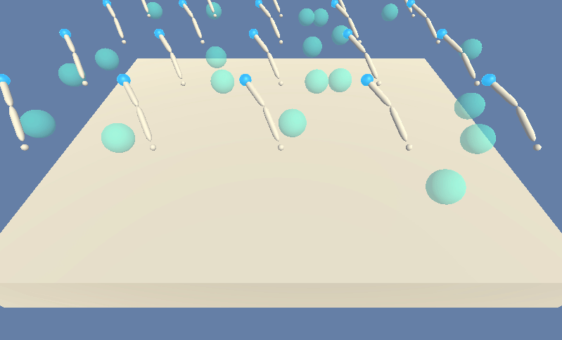
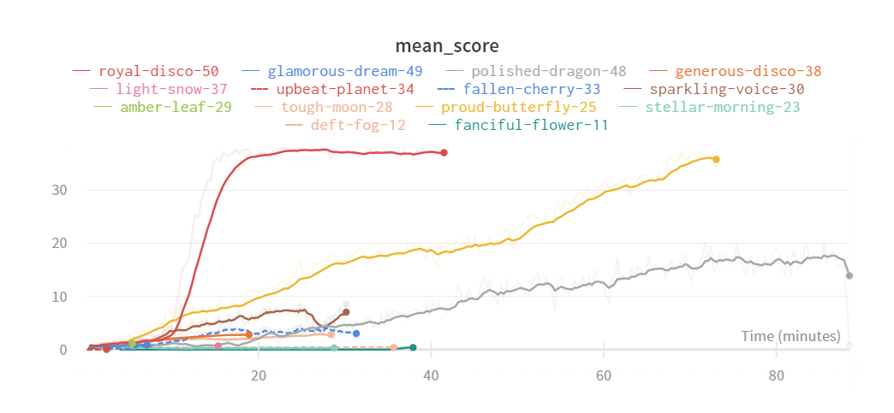

# Project 2: Continuous Control - AI DDPG Reacher 

### Introduction

For this project, I've worked with the [Reacher](https://github.com/Unity-Technologies/ml-agents/blob/master/docs/Learning-Environment-Examples.md#reacher) environment.

An untrained agent behaves likes this:

A trained agent looks like this:

Environment and goal information:

- **Environment**: a double-jointed arm can move to target locations.
- **reward**: +0.1 is provided for each step that the agent's hand is in the goal location.
- **Goal**: maintain position at the target location for as many time steps as possible.
- **Observation space**: 33 variables corresponding to position, rotation, velocity, and angular velocities of the arm.
- **Action**: vector with four numbers, corresponding to torque applicable to two joints. Every entry in the action vector should be a number between -1 and 1.

### Instructions for Training and Testing An Agent

Follow the instructions in [`Continuous_Control.ipynb`](./Continuous_Control.ipynb) to get started with training your own version of the agent, or look at the agent in action! 

In the repo you'll also find 2 checkpoints (`checkpoint_actor.pth` and `checkpoint_critic.pth`) to load the trained agent and let him/them do their thing in the environment, checkout [`Continuous_Control.ipynb`](./Continuous_Control.ipynb)!

It took me 50 small tweaks and code optimizations to solve the environment:

For a full report on implementation and training details, please read [`./report.md`](./report.md).

Above chart were collected [in this run](Check out [my weights and biases report ](https://app.wandb.ai/adam_blvck/reacher_ddpg_continuous_control/reports?view=adam_blvck%2FAI_DDPG_Reacher)!), using the wonderful "Weights and Biases" (`pip install wandb`) library, allowing AI researchers to track the performance of deep learning experiments.

### Distributed Training

For this project, we opted to train the agent on 20 identical agents, each with its own copy of the environment. Although it may seem quite challenging, because we're sampling the environment more often from differente angles, I believe this may work to our advantage.
### Solving the Environment

The environment is considered solved when agents average a score of over +30 (over 100 consecutive episodes, and over all agents).  Specifically,
- After each episode, we've added up the rewards that each agent received (without discounting), to get a score for each agent.  This yields 20 (potentially different) scores.  We then take the average of these 20 scores. 
- This yields an **average score** for each episode (where the average is over all 20 agents).

## Dependencies & Repo Structure

### Getting Started

1. Download the environment from one of the links below.  You need only select the environment that matches your operating system:

    - **_Version 1: One (1) Agent_**
        - Linux: [click here](https://s3-us-west-1.amazonaws.com/udacity-drlnd/P2/Reacher/one_agent/Reacher_Linux.zip)
        - Mac OSX: [click here](https://s3-us-west-1.amazonaws.com/udacity-drlnd/P2/Reacher/one_agent/Reacher.app.zip)
        - Windows (32-bit): [click here](https://s3-us-west-1.amazonaws.com/udacity-drlnd/P2/Reacher/one_agent/Reacher_Windows_x86.zip)
        - Windows (64-bit): [click here](https://s3-us-west-1.amazonaws.com/udacity-drlnd/P2/Reacher/one_agent/Reacher_Windows_x86_64.zip)

    - **_Version 2: Twenty (20) Agents_**
        - Linux: [click here](https://s3-us-west-1.amazonaws.com/udacity-drlnd/P2/Reacher/Reacher_Linux.zip)
        - Mac OSX: [click here](https://s3-us-west-1.amazonaws.com/udacity-drlnd/P2/Reacher/Reacher.app.zip)
        - Windows (32-bit): [click here](https://s3-us-west-1.amazonaws.com/udacity-drlnd/P2/Reacher/Reacher_Windows_x86.zip)
        - Windows (64-bit): [click here](https://s3-us-west-1.amazonaws.com/udacity-drlnd/P2/Reacher/Reacher_Windows_x86_64.zip)
    
    (_For Windows users_) Check out [this link](https://support.microsoft.com/en-us/help/827218/how-to-determine-whether-a-computer-is-running-a-32-bit-version-or-64) if you need help with determining if your computer is running a 32-bit version or 64-bit version of the Windows operating system.

    (_For AWS_) If you'd like to train the agent on AWS (and have not [enabled a virtual screen](https://github.com/Unity-Technologies/ml-agents/blob/master/docs/Training-on-Amazon-Web-Service.md)), then please use [this link](https://s3-us-west-1.amazonaws.com/udacity-drlnd/P2/Reacher/one_agent/Reacher_Linux_NoVis.zip) (version 1) or [this link](https://s3-us-west-1.amazonaws.com/udacity-drlnd/P2/Reacher/Reacher_Linux_NoVis.zip) (version 2) to obtain the "headless" version of the environment.  You will **not** be able to watch the agent without enabling a virtual screen, but you will be able to train the agent.  (_To watch the agent, you should follow the instructions to [enable a virtual screen](https://github.com/Unity-Technologies/ml-agents/blob/master/docs/Training-on-Amazon-Web-Service.md), and then download the environment for the **Linux** operating system above._)

2. Place the file in this cloned folder, and unzip the file. 

### Repo Structure

- `Continuous_Control.ipynb` : The heart of the code, invoking all required functions to put the agent in an environment and in action.
- `ddpg_agent.py` : Agent Class, implementing an actor-critic-like algorithm called "DDPG"
- `model.py` : Model Class, implementing small neural networks for the actor and critic networks.
- `ounoise.py` : OU Noise Class, creates noise samples which are almost like a random walk
- `replaybuffer.py` : Experience Replay Class, implements a replay buffer, used in the DDPG algortihm.

### Dependencies

Beneath a list of depencies required to run and install the agent:

- `python 3.7`
- `unityagents`
- `pytorch`
- `numpy`
- `wandb`
- `jupyter`

