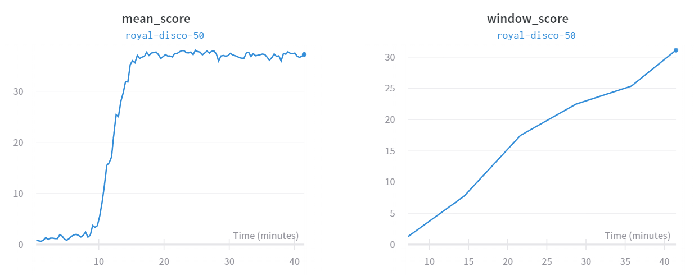
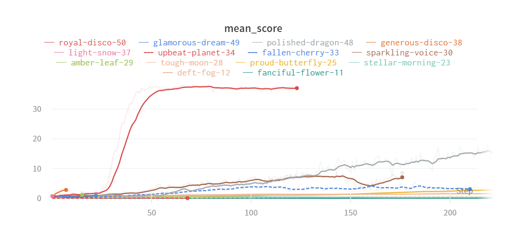

# Project 2 : Continuous Control - Report

## Problem Description

20 non-interacting arms, located in the same environment, are given the task to touch an orbiting ball. How do we accomplish this task?

First, by looking at the state/action space, we see that the problem is a continuous problem: our states and actions are continuous.

From the algorithms we've seen in the Udacity Course Part 3, only a few algorithms are able to deal with continuous problems, amongst others: PPO, A3C, and DDPG.

In this project, we decided to use DDPG. Why?

- It's similar to DQNs, which I've already used in a similar project
- It's an actor-critic algorithm, making it a perfect exercise to practise this paradigm.
- It allows for multiple agent learning by sharing a common replaybuffer, to de-corelate experiences across the agents.

## DDPG Algorithm

DDPG (Deep Deterministic Policy Gradient) is an algorithm that is said to be actor-critic-**ish**. Why is this? Well, in actor-critic algorithms the critic is used to determine the baseline, to critique the actor neural network. In DDPG, the actor-critic intertwinted dance is more akin to DQN, thus the critic is used to approximate the maximizer of the Q-values of the next_state.

In DDPG, we'll be implemented a local and target network. The reason for the seperation is to decouple experiencing the environment from immediately learning about it. Thus we have:

- A local and target network for the actor.
- A local and target network for the critic.

Next, in DDPG, just like in DQN, the agent tries random things and saves its experience in a replay buffer. After the replay buffer has collected enough samples, training can begin.

Training involves:

1. sampling the replay buffer.
2. updating the critic_local network, based on actor_target predictions
3. updating the actor_local network, based on critic_local predictions
4. updating the target networks of both actor and critic. 

Below some pseudo-code to explain how training works in DDPG:

~~~~python
# sample memory (replay buffer)
experiences = self.memory.sample()
states, actions, rewards, next_states, dones = experiences

# Get next actions, by ACTOR
actions_next = self.actor_target(next_states)

# get Q-values for (STATE,ACTION) pair, by CRITIC
Q_targets_next = self.critic_target(next_states, actions_next)

# compute Q targets (discounted)
Q_targets = rewards + (gamma * Q_targets_next * (1 - dones))

# compute critic loss (how much off is the critic_local compaired to critic_target)
Q_expected = self.critic_local(states, actions)
critic_loss = F.mse_loss(Q_expected, Q_targets)

# minimize loss (pytorch style)
self.critic_optimizer.zero_grad()
critic_loss.backward()
self.critic_optimizer.step()
~~~~

Next, we update the actor based on the critic_local's estimates :

~~~python
# computer actor loss
actions_pred = self.actor_local(states)
actor_loss = -self.critic_local(states, actions_pred).mean()

# minimize loss (pytorch style)
self.actor_optimizer.zero_grad()
actor_loss.backward()
self.actor_optimizer.step()
~~~

Finally, we slowly update the target networks:

~~~python
# slowly update target networks
self.soft_update(self.critic_local, self.critic_target, self.TAU)
self.soft_update(self.actor_local, self.actor_target, self.TAU)
~~~

Finally, we want the agent to try new things out, to make him learn new things. Since we're working with a continuous space, we can't just epsilon-greedy select actions. To allow the agent to experience new things, we inject noise to the return **action-space**, using the **Ornstein-Uhlenbeck process**. Using an Ornstein-Uhlenbeck process which return stochastic noise values, which resemble that of a **random walk**, ie: next values are slightly correlated with previous values, but **mean-reverting** in the long term.

## Implementation & Training

Training of the algorithm involves choosing a neural network architecture for the actor and critic. It also involves tweaking hyperparameters.

In total I trained over 50 agents, every so slightly tweaking and modifying my hyperparameters, double checking my backpropagation code, and seeking to understand why my agent wasn't learning.

However, after some persistence I stumbled upon the breakthrough:

- Increased my **BATCH_SIZE** to 512 (was 128 in all other runs)
- Increased my **LEARN_INTERVAL** from 1 (default) to 6 = Learn every 6 steps
- Increased my **LEARN_NUM** from 1 (default) to 2 = learn twice every 6 steps

My best-solving run (30+ score, over 100 episodes, over 20 agents), I used the following neural network architectures:

Actor:

- Input (Fully Connected): State Size x 512
- Hidden (Fully Connected): 512 x 256
- Output (Fully Connected): 256 x action_size

Critic:

- Input (Fully Connected): State Size x 512
- Hidden (Fully Connected): {512 + (action_size) } x 256
- Output (Fully Connected): 256 x 1

The Hyperparameter of the solved environment:

| Hyperparameter | Value    | Usage                                                        |
| -------------- | -------- | ------------------------------------------------------------ |
| BUFFER_SIZE    | int(1e5) | Replay buffer size                                           |
| BATCH_SIZE     | 512      | Mini-Batch size for training                                 |
| GAMMA          | 0.99     | Discount Factor                                              |
| TAU            | 1e-3     | Soft-update factor of target weights                         |
| LR_ACTOR       | 1e-3     | Actor's Learning Rate                                        |
| LR_CRITIC      | 1e-3     | Critic's Learning Rate                                       |
| WEIGHT_DECAY   | 0        | Weight Decay (form of regularization)                        |
| OU_SIGMA       | 0.20     | Ornstein-Uhlenbeck Process - Sigma (volatility)              |
| OU_THETA       | 0.15     | Ornstein-Uhlenbeck Process - Theta (speed of mean-reversion) |
| LEARN_INTERVAL | 6        | Learn every X timesteps                                      |
| LEARN_NUM      | 2        | Learn X times (when learning on interval)                    |

 This is how the training looked like:

And this is how the best run looks like compared to other runs:

Want to take a look at all runs and their respective hyperparameters? Check out [my weights and biases report ](https://app.wandb.ai/adam_blvck/reacher_ddpg_continuous_control/reports?view=adam_blvck%2FAI_DDPG_Reacher)!

## Evaluation & Future Work

First of all, pfew! That was a lot of trial and error. But I'm happy to solve the environment eventually. It's incredible how changing a hyperparameter slightly can impact the results completely. It's literally chaos theory in action. 

With regards to future work, the current state of AI seems all about getting an intuition for environment setup, agent-learning, hyperparameter tuning, and thinking quickly on debug-statements.

I would recommend myself to implement the other fascinating algorithms and compare results in a similar fashion as captured in this project (and compare runs with each other). In particular, the following algorithms come to mind:

- [PPO](https://arxiv.org/pdf/1707.06347.pdf)
- [A3C](https://arxiv.org/pdf/1602.01783.pdf)
- [D4PG](https://openreview.net/pdf?id=SyZipzbCb)

Out of curiosity, I landed on some blogpost explaining the DDPG algorithm, trying to train this exact "Reacher" environment by Udacity. After much explanation, the blogpost shows the reward graph having an average reward of 0.02 after 400 iterations. the blogger's conclusion was that DDPG **can't solve this environment**. Obviously he was wrong, and should have sticked longer to the hyperparameter tweaking.

Which brings me to the next point, what if we could estimate the gradient of hyperparameters and thus build an AI that trains how to train a 'lower version' of himself? This way, a running algorithm could just optimize itself.

My final point is that for me training AI agents has almost zero intuition to it. A lot of it feels like trying to do something to get a marginal better result on a scoreboard. I'm wondering if someone could make a big chart of all AI algorithms next to each other, and like a 'tree-of-life', classify them by complexity, or inherent algorithmic properties. Perhaps after doing such a segmentation, one could easier imagine a "next step" on a "promising branch" of AI algorithms, and thus speed up research.